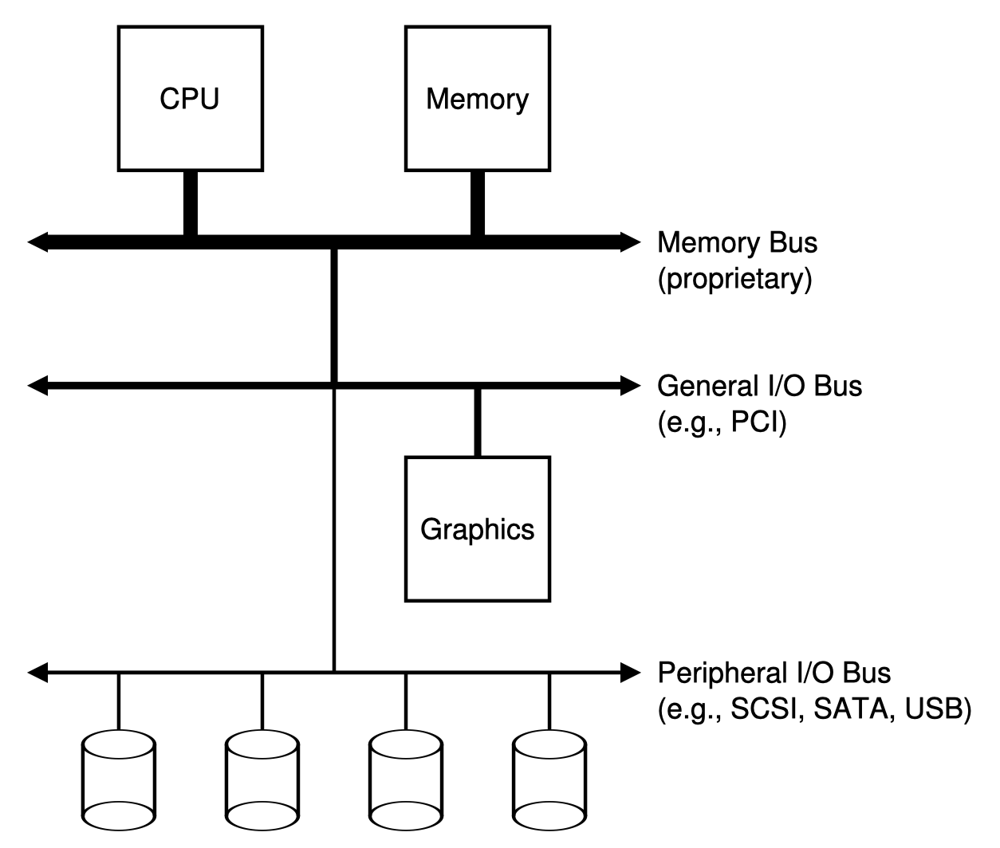

# 28. I/O Devices
How should I/O be integrated into systems? What are the general mechanisms? How can we make them efficient?

The picture below is a classical diagram of a typical system. It shows a single CPU attached to the main memory of the system, via some kind of memory bus or interconnect. Some devices are connected to the system via a general I/O bus, which in many modern systems would be PCI; graphics and some other higher-performance I/O devices might be found here. Finally, even lower down are one or more peripheral bus, such as SCSI, SATA, or USB. These connect slow devices to the system, including disks, mice, and keyboards.

Why do we need a hierarchical structure like this? Put simply: physics, and cost. The faster a bus is, the shorter it must be; thus, a high-performance memory bus does not have much room to plug devices into it. In addition, engineering a bus for high performance is costly. Thus, system designers have adopted this hierarchical approach, where components that demand high performance (such as the graphics card) are nearer the CPU. Lower performance components are further away. The benefits of placing disks and other slow devices on a peripheral bus are manifold; in particular, you can place a large number of devices on it.

